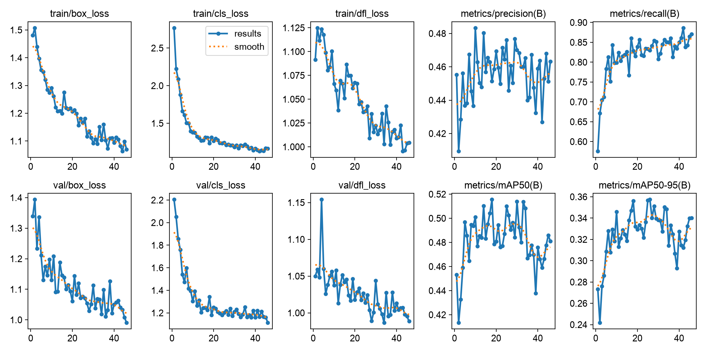
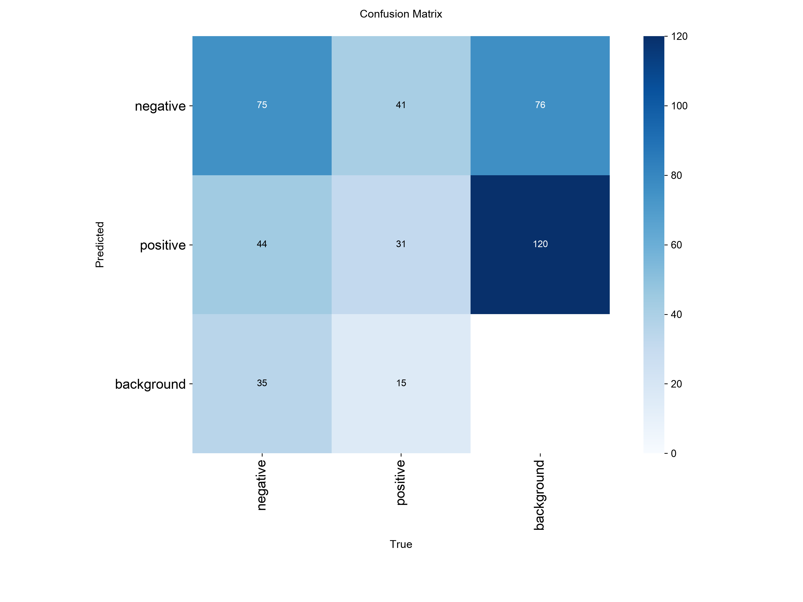
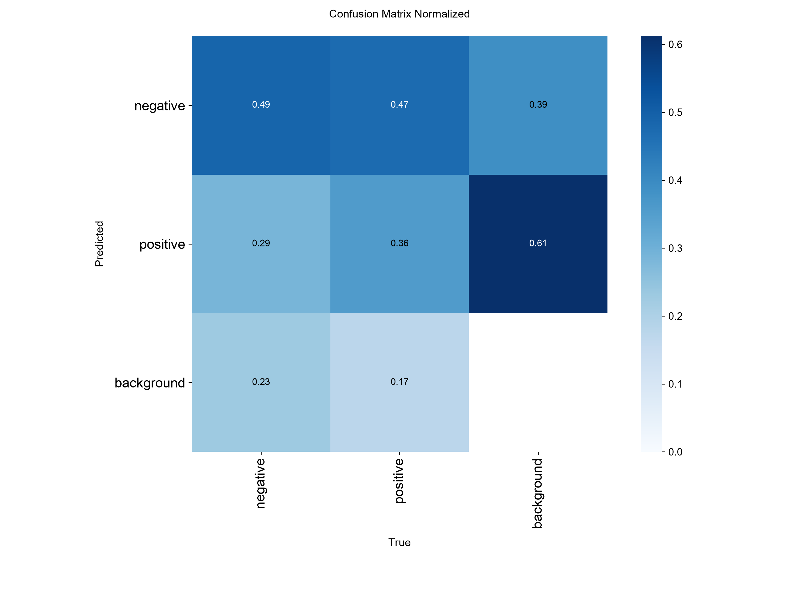
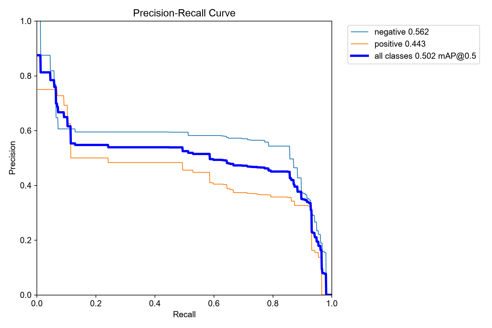
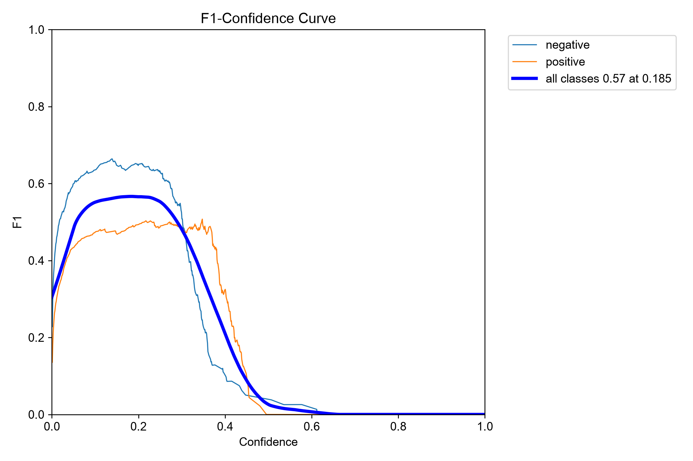
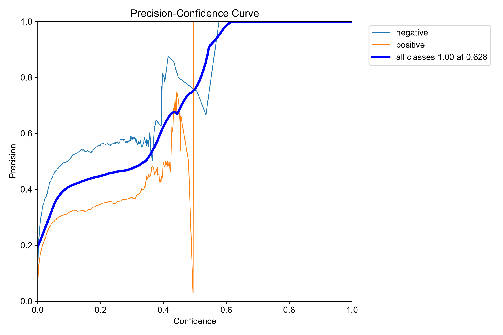
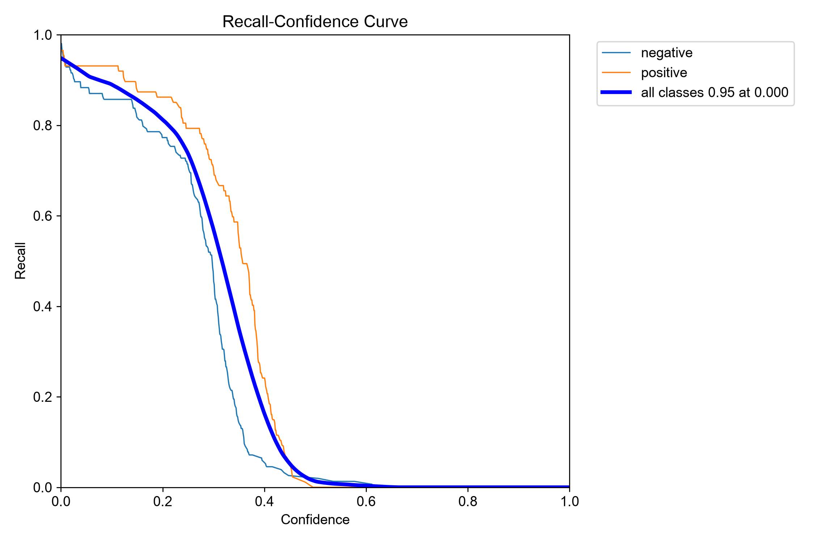

# 🧠 Brain Tumor Detection using YOLO11n

<p align="center">
  
</p>

<p align="center">
  <b>Brain MRI tumor detection using YOLO11n and the Ultralytics framework</b>
</p>

---

## 📌 Project Overview

This project implements a **brain tumor detection system using YOLO11n** and the Ultralytics YOLO framework.

The model was trained on a brain tumor MRI dataset with two classes:

- **0 — negative**
- **1 — positive**

The complete project covers dataset preparation, annotation verification, YOLO training, validation, evaluation, visualization, and inference.

> **Important:** This project is for educational and research purposes only. It is not a medical diagnostic system and must not be used for clinical decision-making.

---

## 🎯 Project Objectives

The main objectives are:

- Detect tumor-related findings from brain MRI images.
- Train a lightweight YOLO11n model.
- Evaluate the model using Precision, Recall, mAP@50, and mAP@50-95.
- Generate confusion matrices and training curves.
- Save the best trained YOLO model as `best.pt`.
- Provide scripts for image, video, and webcam inference.
- Maintain a reproducible and GitHub-ready computer vision project.

---

## 🧠 Model Information

### YOLO11n

This project uses **YOLO11n (YOLO11 Nano)**.

Final validation log:

| Property | Value |
|---|---:|
| Model | YOLO11n |
| Task | Object Detection |
| Parameters | 2,582,542 |
| Layers | 100 fused layers |
| GFLOPs | 6.4 |
| Image Size | 320 × 320 |
| Batch Size | 2 |
| Maximum Epochs | 100 |
| Actual Epochs | 46 |
| Best Epoch | 26 |
| Device | CPU |
| Python | 3.14.3 |
| PyTorch | 2.14.0+cpu |
| Ultralytics | 8.4.163 |

The final validation log reports 2,582,542 parameters and 6.4 GFLOPs for the fused YOLO11n model. 

---

# 📊 Dataset

The project uses the **Ultralytics Brain Tumor dataset**.

### Dataset classes

```text
0 → negative
1 → positive
```

### Dataset counts

| Split | Images |
|---|---:|
| Training | 893 |
| Validation | 223 |
| Classes | 2 |

The final validation run evaluated **223 images and 241 annotated instances**.

### Dataset structure

```text
brain-tumor/
├── images/
│   ├── train/
│   └── val/
│
├── labels/
│   ├── train/
│   └── val/
│
├── brain-tumor.yaml
└── LICENSE.txt
```

---

# ⚙️ Dataset Configuration

The project uses a YOLO data configuration similar to:

```yaml
path: C:/Users/aishi/Downloads/brain_yolo_project/brain_yolo_project/brain-tumor

train: images/train
val: images/val

names:
  0: negative
  1: positive
```

For another computer, update the `path` to the local location of the dataset.

---

# 🚀 Training Configuration

The final training configuration was:

```text
Model        : YOLO11n
Epochs       : 100 maximum
Image Size   : 320
Batch Size   : 2
Device       : CPU
Workers      : 0
Patience     : 20
```

Example training code:

```python
from ultralytics import YOLO

model = YOLO("yolo11n.pt")

model.train(
    data="dataset/data.yaml",
    epochs=100,
    imgsz=320,
    batch=2,
    device="cpu",
    workers=0,
    patience=20
)
```

---

# ⏱️ Training Progress

Training was configured for a maximum of 100 epochs.

Early stopping was triggered after **46 epochs** because no improvement was observed for the configured 20-epoch patience period.

The **best results were observed at epoch 26**, and the best model was saved as:

```text
best.pt
```

The complete run took approximately:

```text
22.499 hours
```

The training log records that 46 epochs completed in approximately 22.5 hours and that the best model was saved at epoch 26.

---

# 📈 Training Results

The main Ultralytics training graph is stored in:

```text
results/results.png
```

<p align="center">
  
</p>

---

# 🔲 Confusion Matrix

The confusion matrix is stored in:

```text
results/confusion_matrix.png
```

<p align="center">
  
</p>

---

# 🔲 Normalized Confusion Matrix

The normalized confusion matrix is stored in:

```text
results/confusion_matrix_normalized.png
```

<p align="center">
  
</p>

---

# 📈 Precision-Recall Curve

If available in the `results/` directory:

<p align="center">
  
</p>

---

# 📈 F1 Curve

<p align="center">
  
</p>

---

# 📈 Precision Curve

<p align="center">
  
</p>

---

# 📈 Recall Curve

<p align="center">
  
</p>

---

# 📊 Final Model Performance

The saved `best.pt` model was validated on the validation set.

| Metric | Overall |
|---|---:|
| **Precision** | **44.5%** |
| **Recall** | **83.0%** |
| **mAP@50** | **50.2%** |
| **mAP@50-95** | **35.7%** |

These are the final validation values reported by the training run.

---

## 📋 Class-wise Performance

| Class | Images | Instances | Precision | Recall | mAP@50 | mAP@50-95 |
|---|---:|---:|---:|---:|---:|---:|
| Negative | 142 | 154 | 55.1% | 78.6% | 56.2% | 38.7% |
| Positive | 81 | 87 | 33.9% | 87.4% | 44.3% | 32.8% |
| **Overall** | **223** | **241** | **44.5%** | **83.0%** | **50.2%** | **35.7%** |

---

# 🔍 Understanding the Metrics

### Precision

Precision measures how many of the model's predicted positive detections were correct.

```text
Precision = TP / (TP + FP)
```

Final overall precision:

```text
44.5%
```

### Recall

Recall measures how many of the actual positive instances were detected.

```text
Recall = TP / (TP + FN)
```

Final overall recall:

```text
83.0%
```

### mAP@50

Mean Average Precision calculated using an IoU threshold of 0.50.

```text
mAP@50 = 50.2%
```

### mAP@50-95

Mean Average Precision averaged over IoU thresholds from 0.50 to 0.95.

```text
mAP@50-95 = 35.7%
```

---

# 📌 Validation Summary

```text
Validation Images       : 223
Validation Instances    : 241

Precision               : 0.445
Recall                  : 0.830
mAP@50                  : 0.502
mAP@50-95               : 0.357
```

Class-wise:

```text
Negative:
Precision   = 0.551
Recall      = 0.786
mAP@50      = 0.562
mAP@50-95   = 0.387

Positive:
Precision   = 0.339
Recall      = 0.874
mAP@50      = 0.443
mAP@50-95   = 0.328
```

---

# 💾 Trained Model

The best trained model is:

```text
models/best.pt
```

The original training run produced:

```text
best.pt
last.pt
```

The `best.pt` model corresponds to the best validation result selected during training.

> The model file is approximately 5.4 MB after optimizer stripping in the final training output.

---

# 🔎 Inference

Example Python inference:

```python
from ultralytics import YOLO

model = YOLO("models/best.pt")

results = model("examples/test.jpg")

for result in results:
    result.show()
```

---

# 📷 Image Inference

The project contains:

```text
scripts/infer_image.py
```

Run:

```bash
python scripts/infer_image.py
```

---

# 🎥 Video Inference

The project contains:

```text
scripts/infer_video.py
```

Run:

```bash
python scripts/infer_video.py
```

---

# 📹 Webcam Inference

The project contains:

```text
scripts/infer_webcam.py
```

Run:

```bash
python scripts/infer_webcam.py
```

---

# 📊 Evaluation

The project contains:

```text
scripts/evaluate.py
```

Run:

```bash
python scripts/evaluate.py
```

---

# 🧪 Annotation Verification

The project contains:

```text
scripts/verify_annotations.py
```

This script can be used to check the YOLO annotation files before training.

Run:

```bash
python scripts/verify_annotations.py
```

---

# 📁 Project Structure

```text
brain-tumor-yolo-detection/
│
├── README.md
├── requirements.txt
├── .gitignore
│
├── dataset/
│   └── data.yaml
│
├── scripts/
│   ├── evaluate.py
│   ├── export_model.py
│   ├── infer_image.py
│   ├── infer_video.py
│   ├── infer_webcam.py
│   ├── prepare_dataset_optionA.py
│   ├── train_optionA_bigger.py
│   └── verify_annotations.py
│
├── results/
│   ├── results.png
│   ├── confusion_matrix.png
│   ├── confusion_matrix_normalized.png
│   ├── PR_curve.png
│   ├── F1_curve.png
│   ├── P_curve.png
│   └── R_curve.png
│
├── models/
│   └── best.pt
│
└── examples/
    └── sample images
```

---

# 🛠️ Technologies Used

- **Python**
- **Ultralytics YOLO**
- **YOLO11n**
- **PyTorch**
- **OpenCV**
- **NumPy**
- **Matplotlib**
- **Computer Vision**
- **Deep Learning**

---

# 📦 Installation

Clone the repository:

```bash
git clone https://github.com/AishiGhosh2006/brain-tumor-yolo-detection.git
```

Enter the project:

```bash
cd brain-tumor-yolo-detection
```

Create a virtual environment:

```bash
python -m venv .venv
```

Activate it on Windows:

```powershell
.venv\Scripts\Activate.ps1
```

Install dependencies:

```bash
pip install -r requirements.txt
```

---

# ▶️ Quick Start

After installing dependencies and placing the dataset in the configured location:

```bash
python scripts/verify_annotations.py
```

Then train:

```bash
python scripts/train_optionA_bigger.py
```

For inference using the trained model:

```text
models/best.pt
```

---

# 🔮 Future Improvements

Possible future improvements include:

- Train with a larger and more diverse MRI dataset.
- Experiment with higher image resolutions.
- Compare YOLO11n with larger YOLO variants.
- Use GPU acceleration for faster training.
- Perform systematic hyperparameter tuning.
- Experiment with batch size and learning rate.
- Apply appropriate data augmentation.
- Investigate class imbalance.
- Improve precision while maintaining recall.
- Evaluate using an independent external dataset.
- Add a web interface for uploading MRI images.
- Build an API for model inference.
- Deploy the model as an educational demonstration application.

---

# ⚠️ Limitations

The current experiment has several limitations:

1. Training was performed on CPU.
2. The training image size was 320 × 320.
3. The dataset is limited to the provided training and validation split.
4. The reported results are dataset-specific.
5. The model has not been clinically validated.
6. The model should not be used for diagnosis or treatment decisions.
7. Performance on external MRI datasets may differ from the reported validation results.

---

# ⚠️ Medical Disclaimer

This project is intended **only for educational and research purposes**.

It is **not a medical device**, **not clinically validated**, and **must not be used to diagnose brain tumors or make medical decisions**.

Any real medical interpretation of MRI scans should be performed by qualified healthcare professionals using appropriate clinical procedures.

---

# 👩‍💻 Author

## Aishi Ghosh

Computer Science Engineering Student

GitHub:

https://github.com/AishiGhosh2006

Project:

https://github.com/AishiGhosh2006/brain-tumor-yolo-detection

---

# ⭐ Acknowledgements

- Ultralytics YOLO
- YOLO11 architecture
- Brain Tumor dataset used for this project
- PyTorch
- OpenCV
- NumPy
- Matplotlib

---

# 📜 License

Please refer to the dataset's included `LICENSE.txt` and the licenses of the software libraries used in this project.

---

# 📌 Project Summary

```text
╔══════════════════════════════════════════════╗
║        BRAIN TUMOR YOLO11n DETECTION         ║
╠══════════════════════════════════════════════╣
║ Model              : YOLO11n                 ║
║ Classes            : 2                       ║
║ Training Images    : 893                     ║
║ Validation Images  : 223                     ║
║ Image Size         : 320 × 320               ║
║ Batch Size         : 2                       ║
║ Best Epoch         : 26                      ║
║ Actual Epochs      : 46                      ║
║ Precision          : 44.5%                   ║
║ Recall             : 83.0%                   ║
║ mAP@50             : 50.2%                   ║
║ mAP@50-95          : 35.7%                   ║
║ Device             : CPU                     ║
╚══════════════════════════════════════════════╝
```
